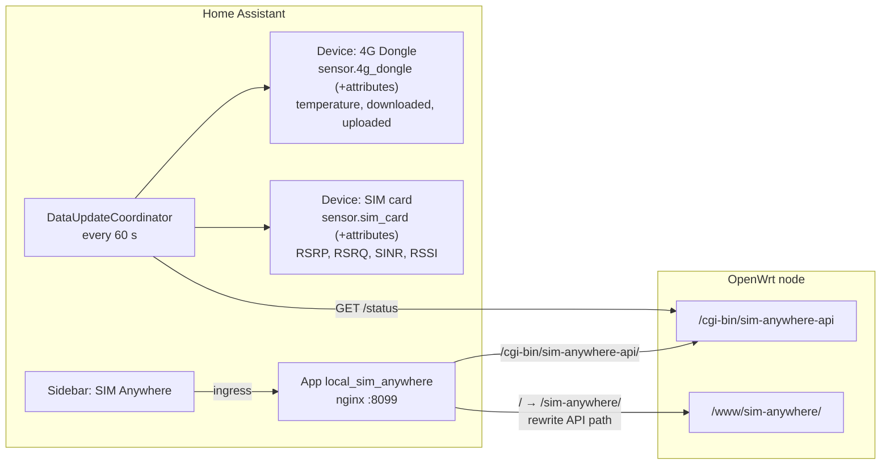

# HASS

```mermaid
flowchart LR
  subgraph Node["OpenWrt node"]
    api["/cgi-bin/sim-anywhere-api"]
    www["/www/sim-anywhere/"]
  end
  subgraph HA["Home Assistant"]
    coord["DataUpdateCoordinator<br/>every 60 s"]
    coord --> dev1["Device: 4G Dongle<br/>sensor.4g_dongle (+attributes)<br/>temperature, downloaded, uploaded"]
    coord --> dev2["Device: SIM card<br/>sensor.sim_card (+attributes)<br/>RSRP, RSRQ, SINR, RSSI"]
    addon["App local_sim_anywhere<br/>nginx :8099"]
    sidebar["Sidebar: SIM Anywhere"] -- "ingress" --> addon
  end
  coord -- "GET /status" --> api
  addon -- "/ → /sim-anywhere/<br/>rewrite API path" --> www
  addon -- "/cgi-bin/sim-anywhere-api/" --> api
```
