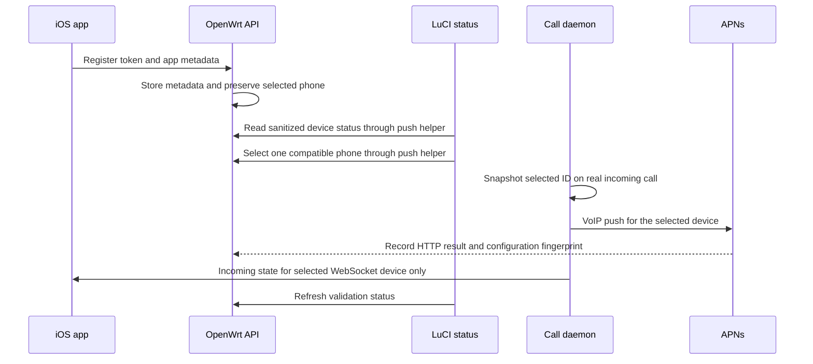

# Incoming-call device routing

```mermaid
sequenceDiagram
    participant A as iOS app
    participant N as OpenWrt API
    participant L as LuCI status
    participant C as Call daemon
    participant P as APNs
    A->>N: Register token and app metadata
    N->>N: Store metadata and preserve selected phone
    L->>N: Read sanitized device status through push helper
    L->>N: Select one compatible phone through push helper
    C->>C: Snapshot selected ID on real incoming call
    C->>P: VoIP push for the selected device
    P-->>N: Record HTTP result and configuration fingerprint
    C->>A: Incoming state for selected WebSocket device only
    L->>N: Refresh validation status
```
