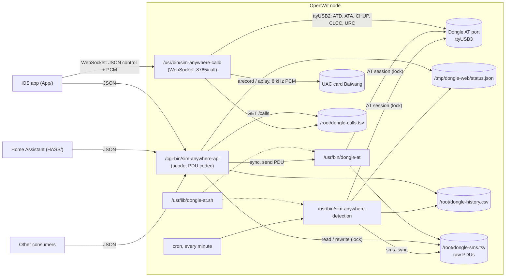
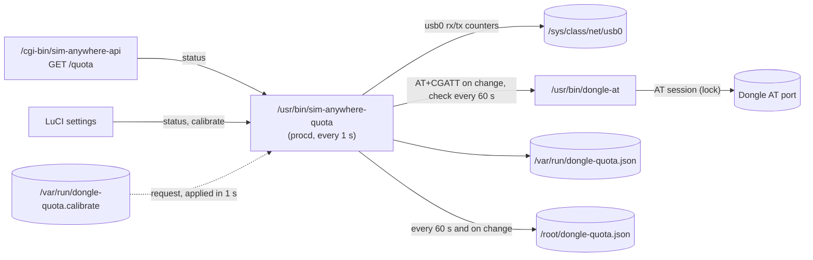
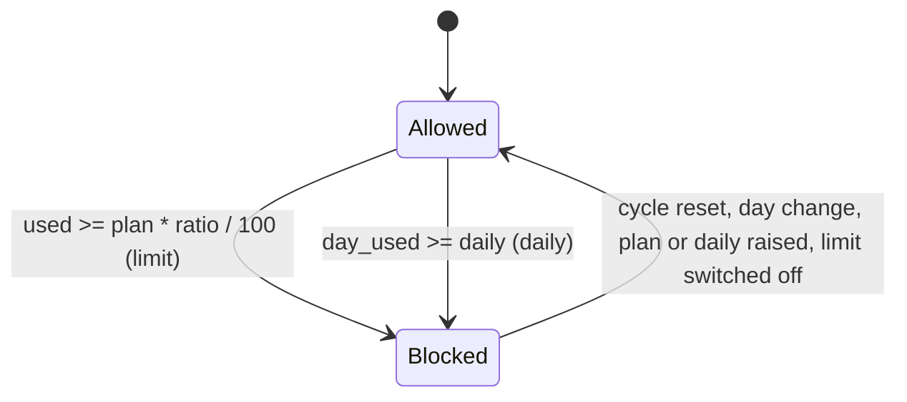

# Dongle Monitor

```mermaid
flowchart LR
  subgraph Node["OpenWrt node"]
    cron["cron, every minute"] --> collect["/usr/bin/sim-anywhere-detection"]
    collect -- "AT session (lock)" --> modem[("Dongle AT port<br/>ttyUSB3")]
    collect --> status[("/tmp/dongle-web/status.json")]
    collect --> hist[("/root/dongle-history.csv")]
    collect -- "sms_sync" --> sms[("/root/dongle-sms.tsv<br/>raw PDUs")]
    api["/cgi-bin/sim-anywhere-api<br/>(ucode, PDU codec)"] --> status
    api --> hist
    api -- "read / rewrite (lock)" --> sms
    api -- "sync, send PDU" --> at["/usr/bin/dongle-at"]
    at -- "AT session (lock)" --> modem
    at --> sms
    calld["/usr/bin/sim-anywhere-calld<br/>(WebSocket :8765/call)"] -- "ttyUSB2: ATD, ATA, CHUP, CLCC, URC" --> modem
    calld -- "arecord / aplay, 8 kHz PCM" --> uac[("UAC card Baiwang")]
    calld --> calls[("/root/dongle-calls.tsv")]
    api -- "GET /calls" --> calls
    lib["/usr/lib/dongle-at.sh"] -.-> collect
    lib -.-> at
  end
  other["Other consumers"] -- "JSON" --> api
  ha["Home Assistant (HASS/)"] -- "JSON" --> api
  ios["iOS app (App/)"] -- "JSON" --> api
  ios -- "WebSocket: JSON control + PCM" --> calld
```

## Data limit

```mermaid
flowchart LR
  quota["/usr/bin/sim-anywhere-quota<br/>(procd, every 1 s)"] -- "usb0 rx/tx counters" --> usb0[("/sys/class/net/usb0")]
  quota -- "AT+CGATT on change, check every 60 s" --> at2["/usr/bin/dongle-at"]
  at2 -- "AT session (lock)" --> modem2[("Dongle AT port")]
  quota --> live[("/var/run/dongle-quota.json")]
  quota -- "every 60 s and on change" --> state[("/root/dongle-quota.json")]
  api["/cgi-bin/sim-anywhere-api<br/>GET /quota"] -- "status" --> quota
  page["LuCI settings"] -- "status, calibrate" --> quota
  calib[("/var/run/dongle-quota.calibrate")] -. "request, applied in 1 s" .-> quota
```

```mermaid
stateDiagram-v2
  [*] --> Allowed
  Allowed --> Blocked: used >= plan * ratio / 100 (limit)
  Allowed --> Blocked: day_used >= daily (daily)
  Blocked --> Allowed: cycle reset, day change, plan or daily raised, limit switched off
```
