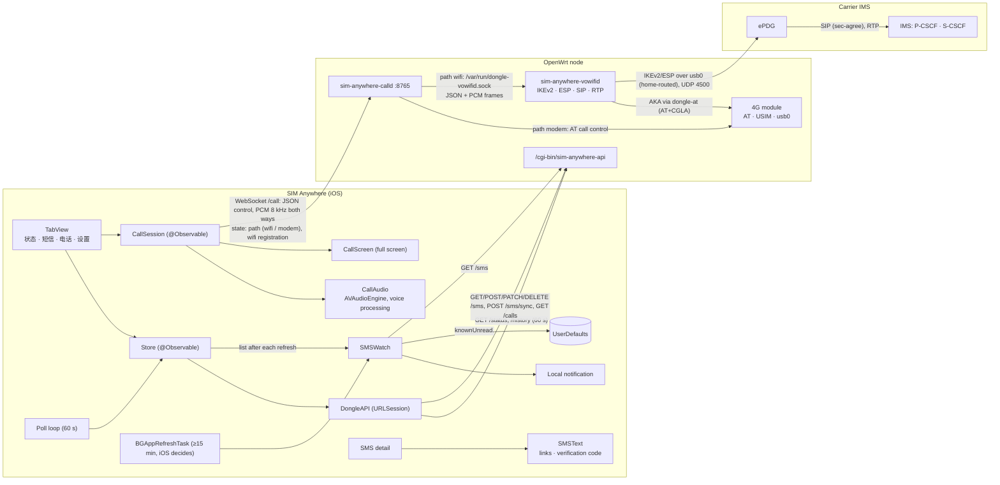

# SIM Anywhere

```mermaid
flowchart LR
  subgraph App["SIM Anywhere (iOS)"]
    tabs["TabView<br/>状态 · 短信 · 电话 · 设置"] --> store["Store (@Observable)"]
    tabs --> phone["CallSession (@Observable)"]
    phone --> audio["CallAudio<br/>AVAudioEngine, voice processing"]
    phone --> screen["CallScreen (full screen)"]
    store --> api["DongleAPI (URLSession)"]
    poll["Poll loop (60 s)"] --> store
    store -- "list after each refresh" --> watch["SMSWatch"]
    bg["BGAppRefreshTask (≥15 min, iOS decides)"] --> watch
    watch --> notif["Local notification"]
    watch -- "knownUnread.<host>" --> defaults[("UserDefaults")]
    sms["SMS detail"] --> text["SMSText<br/>links · verification code"]
  end
  subgraph Node["OpenWrt node"]
    ep["/cgi-bin/sim-anywhere-api"]
    calld["sim-anywhere-calld :8765"]
    vowifid["sim-anywhere-vowifid<br/>IKEv2 · ESP · SIP · RTP"]
    modem["4G module<br/>AT · USIM · usb0"]
  end
  subgraph M1["Carrier IMS"]
    epdg["ePDG"]
    ims["IMS: P-CSCF · S-CSCF"]
  end
  phone -- "WebSocket /call: JSON control, PCM 8 kHz both ways<br/>state: path (wifi / modem), wifi registration" --> calld
  calld -- "path modem: AT call control" --> modem
  calld -- "path wifi: /var/run/dongle-vowifid.sock<br/>JSON + PCM frames" --> vowifid
  vowifid -- "AKA via dongle-at (AT+CGLA)" --> modem
  vowifid -- "IKEv2/ESP over usb0 (home-routed), UDP 4500" --> epdg
  epdg -- "SIP (sec-agree), RTP" --> ims
  api -- "GET /status, /history (60 s)" --> ep
  api -- "GET/POST/PATCH/DELETE /sms, POST /sms/sync, GET /calls" --> ep
  watch -- "GET /sms" --> ep
```
